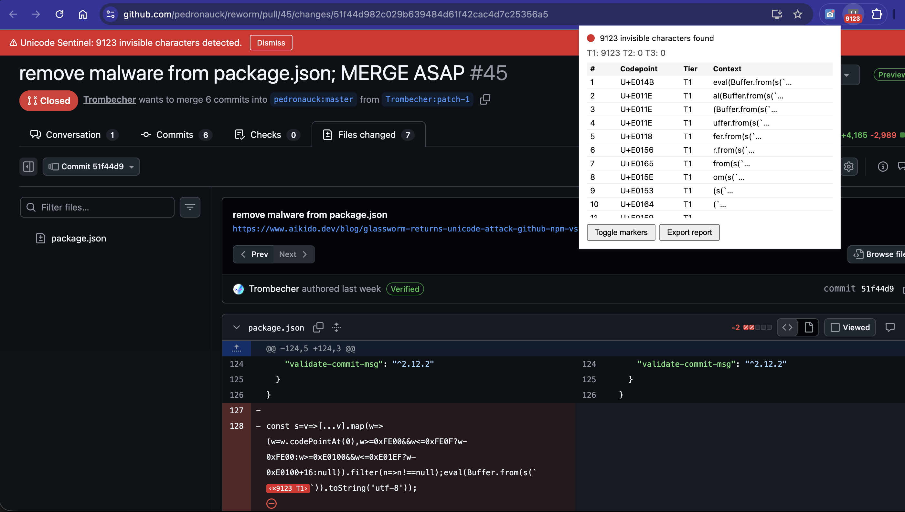

# Unicode Sentinel

Chrome extension that detects invisible Unicode characters used in supply-chain attacks ([Glassworm](https://www.aikido.dev/blog/glassworm-returns-unicode-attack-github-npm-vscode)).

Scans code blocks on any page for PUA codepoints, variation selectors, bidi overrides, and zero-width characters. Highlights them inline and shows a warning banner.



## Build

```
npm install
npm run build
```

## Test

```
npm test
```

## Install

1. `chrome://extensions`: enable Developer mode
2. Load unpacked: select this project folder
3. Visit any GitHub commit/PR page or open `tests/fixture.html`
