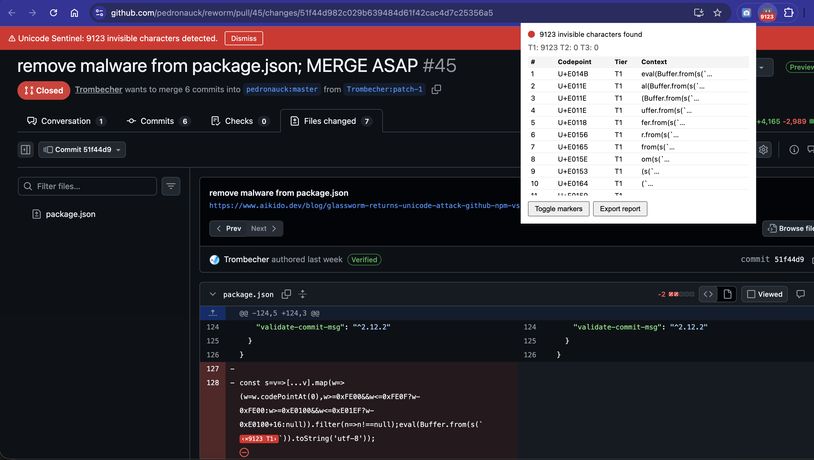

# Unicode Sentinel

Chrome extension that detects invisible Unicode characters used in supply-chain attacks ([Glassworm](https://www.aikido.dev/blog/glassworm-returns-unicode-attack-github-npm-vscode)).

Scans code blocks for PUA codepoints, variation selectors, bidi overrides, and zero-width characters. Highlights them inline and shows a warning banner.



## How it scans

Scanning is **on-demand**. The extension does not run automatically on every page you visit - you click the toolbar action to scan the current tab. This minimises permissions: the manifest declares only `activeTab`, `storage`, and `scripting`, with no host permissions and no auto-injected content script.

Flow:

1. Click the toolbar icon → popup opens.
2. Click **Scan this page** → background worker tries to message an existing content script first; if none answers, it injects `dist/src/content/content.js` and `dist/content.css` via `chrome.scripting`.
3. The content script walks `pre`, `code`, and other code-block selectors, classifies each invisible codepoint into tiers (T1 dangerous, T2 suspicious, T3 informational), and streams findings back to the worker.
4. The worker keeps per-tab state (findings, signature matches, badge counters) and the popup polls `GET_FINDINGS` until the scan completes.

If the active tab is restricted (chrome://, the Web Store, the devtools origin, file:// without permission), the popup shows **"This page can't be scanned"** instead of spinning to a timeout.

## Build

```
npm install
npm run build
```

Outputs bundled extension assets to `dist/`. Use `npm run watch` for incremental rebuilds.

## Test

```
npm test
```

Jest with jsdom. 151 tests across scanner, signatures, content script handlers, background worker state, popup UI, and observer suspension behavior.

## Install

1. `chrome://extensions`: enable Developer mode
2. Load unpacked: select this project folder
3. Visit any GitHub commit/PR page or open `tests/fixture.html`
4. Click the Unicode Sentinel toolbar icon → **Scan this page**

## Settings

Open the extension's options page from `chrome://extensions` to configure:

- **Scan scope** - `code_blocks` (default) or `full_page`
- **Inline markers** - wrap each invisible codepoint in a marker span (default on)
- **Group threshold** - collapse runs of N consecutive same-tier codepoints into a single marker
- **Banner T3 threshold** - minimum T3 count before the page banner appears
- **Export options** - redact URLs, strip context bytes from exports
- **Signature ruleset URL** - fetch updated signatures from a remote source

Settings changes apply on the next scan without reloading the page.
